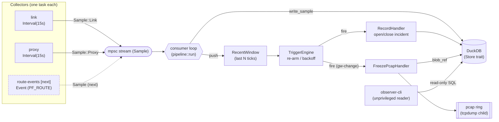
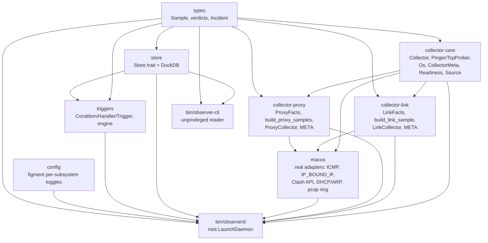

# Architecture

`observer` is a Rust network-forensics collector for macOS. It replaces a
hand-rolled ~470-line `bash` LaunchDaemon (`net-observer`) with a structured,
queryable pipeline whose north star is **incident forensics**: a rich, SQL-able
snapshot of network/system state *around outages*, so post-incident analysis is
a query ("что было в 17:26") instead of grepping a columnar text log.

**v1 scope = observe + detect, never act.** The daemon collects telemetry and
fires *passive* triggers (record an incident, freeze the pcap ring). No
`launchctl kickstart`, no watchdog, no notifications in v1 — those are later
handlers behind the same `Condition → Handler` interface. The shell
`net-observer` remains the behavioral oracle (see `AGENTS.md`).

## Pipeline

Collectors emit typed `Sample`s onto an mpsc stream. A single consumer persists
each sample into DuckDB, keeps a small in-memory recent window, and evaluates the
trigger engine on every sample so a freeze can happen *before* the slow
`arp`/`log show` work and before the pcap ring rotates over the packets around a
drop.

- **Collectors** — one task per subsystem, each on its own cadence. `link` and
  `proxy` are `Interval` collectors (timer → `collect(ts_us)` on the blocking
  pool). `Event` collectors (a blocking `EventSource::next()` loop, e.g. a
  PF_ROUTE socket) are supported by the daemon but none ships in v1.
- **Consumer** (`bin/observerd/src/pipeline.rs::run`) — drains the stream,
  writes each sample to the store (a write error is *logged as a gap*, never
  silently dropped), pushes into the `RecentWindow`, and evaluates the engine.
- **TriggerEngine** — starter rules ported from the oracle: `wedge`, `gw-drop`,
  `gw-change` (unconditional pcap freeze on any gateway change), `fakeip`,
  `starvation`. Each fires at most once per 5 min (backoff) and disarms until the
  signal returns to OK.
- **observerd** — the root LaunchDaemon: load config → build enabled collectors
  as `Box<dyn Collector>` → filter by `meta().supports(Os::current())` then
  `preflight()` → spawn survivors → run the consumer → clean SIGTERM/SIGINT
  shutdown.
- **observer-cli** — unprivileged; opens the same DuckDB file read-only for
  `status` / `incidents` / `query`.

### Collector capability model

Every collector carries two capability signals so the daemon decides, per
collector, whether to run it at all:

- **Static OS metadata** — `CollectorMeta { name, supported_os }`; v1 collectors
  declare `&[Os::MacOs]`. A collector whose meta does not `supports(Os::current())`
  is skipped.
- **Runtime preflight** — `preflight() -> Readiness` (`Ready` /
  `Unavailable(String)`), delegated to the port facts: `link` is Ready iff a
  physical interface resolves; `proxy` iff the sing-box config exists or the
  Clash API is set. A failing preflight is logged (absence of a signal is itself
  diagnostic) and the collector is not spawned.

## Crate graph

The monolithic `collectors` crate is split into `collector-core` (abstractions
only) plus one crate per collector. Adding a subsystem (`dns`, `route`, `host`)
means adding a crate that depends on `collector-core`, never touching the others.

- `collector-core` depends on `types` only — and **not** on tokio; `Source` /
  `EventSource` keep it runtime-agnostic. The async driving of both cadences
  lives in `observerd`.
- `collector-link` / `collector-proxy` depend on `types` + `collector-core`; they
  hold the port trait (`LinkFacts` / `ProxyFacts`), the pure `build_*` mapping
  logic (unit-tested with fakes), a static `META`, and the `Collector` impl.
- `macos` implements the port traits with the real adapters (raw ICMP,
  `IP_BOUND_IF` TCP probes, Clash API, DHCP/ARP facts) plus the pcap ring and the
  per-collector `preflight()` checks.
- `bin/observerd` wires everything; `bin/observer-cli` only reads `store`.

## Data model (DuckDB)

Normalized per subsystem — each stream has its own timestamp and cadence;
cross-stream correlation is via DuckDB's native `ASOF JOIN`. Big blobs (pcap
freezes, `log show` dumps) live as files on disk; only a `blob_ref` metadata row
goes in the DB. Timestamps are microseconds since the epoch (`ts_us BIGINT`).

| Table | Columns | Notes |
| --- | --- | --- |
| `link_sample` | `ts_us, gw, gw_rtt_ms, direct, direct_rtt_ms, dhcp_router, dhcp_dns, gw_arp_mac, ssid, wifi_capture_present` | Local path: gateway ping, direct TCP (bound to phys iface), DHCP/ARP facts, Wi-Fi SSID + CoreCapture presence. |
| `proxy_sample` | `ts_us, server_ip, tcp, rtt_ms, tun_code, selector` | Per-VLESS TCP reachability, tun HTTP 204 (`tun_code`), Clash selector. |
| `incident` | `id PK, opened_us, closed_us, trigger_id, signature` | Open incident ⇒ `closed_us IS NULL`. |
| `blob_ref` | `id, incident_id, ts_us, kind, path` | On-disk forensics blobs (pcap freeze, dumps) referenced by path. |
| `trigger_fired` | `ts_us, trigger_id, incident_id, detail` | One row per trigger fire. |

`dns_sample`, `host_sample`, and `route_event` are specified for later
subsystems and are not created by v1.

### Verdict vocabulary

Ported from the oracle and cross-checked against recorded log excerpts:

- DNS: `OK / FAKEIP / EMPTY / SERVFAIL / NXDOMAIN / TIMEOUT / SKIP`
- Gateway: `OK / FAIL / NOGW`
- TCP: `OK / FAIL / SKIP`

`FAKEIP` on a `.ru` name is always a bug. **`SKIP` means a prerequisite was
missing — it is recorded explicitly, never omitted**: absence of a signal is
itself diagnostic.

## Privilege split

`observerd` is a headless **root** LaunchDaemon (needs raw ICMP, PF_ROUTE,
`tcpdump`, reading the sing-box config). `observer-cli` is **unprivileged** and
only reads the DuckDB file. A future menu-bar UI (gpui) is a separate
unprivileged binary over a local socket — never the daemon itself.
