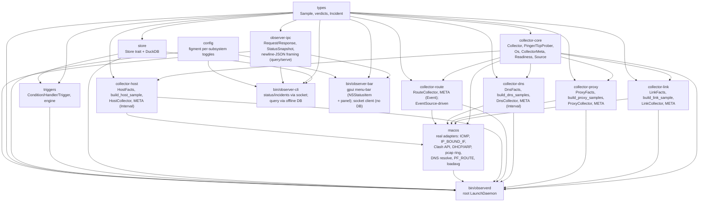

# Architecture

`observer` is a Rust network-forensics collector for macOS. It replaces a
hand-rolled ~470-line `bash` LaunchDaemon (`net-observer`) with a structured,
queryable pipeline whose north star is **incident forensics**: a rich, SQL-able
snapshot of network/system state *around outages*, so post-incident analysis is
a query ("что было в 17:26") instead of grepping a columnar text log.

**v1 scope = observe + detect; act only on an explicit, gated request.** The
daemon collects telemetry and fires *passive* triggers (record an incident,
freeze the pcap ring) — it **never acts automatically**. The single write/control
path is manual and human-in-the-loop: an operator's `Request::Control` (from the
bar's "Restart sing-box" button or the CLI `kickstart` subcommand) asks the daemon
to `launchctl kickstart -k` the sing-box service, and the daemon runs it **only
when `acting.enabled` is set** — off by default, so every acting-class control
request is otherwise refused without running anything. Distinct from acting is an
**observing on/off switch** (`ControlCmd::SetObserving`): benign *self-control*
that pauses/resumes the daemon's OWN collection (the collectors stop producing
samples; the daemon stays alive and the socket keeps serving). It touches neither
sing-box nor the network, so it is **not** gated by `acting.enabled` — see
[Control path](#control-path). No watchdog, no automatic recovery, no
notifications in v1 — those remain later handlers behind the same
`Condition → Handler` interface. The shell `net-observer` remains the behavioral
oracle (see `AGENTS.md`).

## Pipeline

Collectors emit typed `Sample`s onto an mpsc stream. A single consumer persists
each sample into DuckDB, keeps a small in-memory recent window, and evaluates the
trigger engine on every sample so a freeze can happen *before* the slow
`arp`/`log show` work and before the pcap ring rotates over the packets around a
drop.


- **Collectors** — one task per subsystem, each on its own cadence. Every
  collector is a **native `async fn`** (`Collector::collect` / `preflight` are
  `async fn` in the trait — no `async-trait` macro, no future-boxing). `link`,
  `proxy`, `dns`, and `host` are `Interval` collectors: the daemon `await`s
  `collect(ts_us)` directly on the tokio runtime each tick — **never** on the
  blocking pool (the probes do their own async I/O). `route-events` is the first
  **Event** collector and the one true exception: its PF_ROUTE `next()` is a
  genuinely uninterruptible blocking `read(2)`, so the daemon drives it on a
  dedicated OS thread (`std::thread::spawn`, bridged to the async stream via
  `blocking_send`), forwarding samples as the kernel announces interface/route
  changes. See [Async collectors](#async-collectors) below.
- **Consumer** (`bin/observerd/src/pipeline.rs::run`) — drains the stream,
  writes each sample to the store (a write error is *logged as a gap*, never
  silently dropped), mirrors the sample into the live `StatusSnapshot`, pushes
  into the `RecentWindow`, and evaluates the engine.
- **TriggerEngine** — starter rules ported from the oracle: `wedge`, `gw-drop`,
  `gw-change` (unconditional pcap freeze on any gateway change), `fakeip`,
  `starvation`. Each fires at most once per 5 min (backoff) and disarms until the
  signal returns to OK.
- **Live snapshot + local socket API** — the consumer keeps an in-memory
  `StatusSnapshot` (the latest sample per collector + `generated_us`) current on
  every tick, and a passive `SnapshotHandler` mirrors each fired incident into a
  bounded ring (newest first). `observerd` serves this snapshot over a
  Unix-domain socket (`bin/observerd/src/api.rs::serve`, a tokio `UnixListener`),
  answering entirely from memory — no DB read on the request path, zero contention
  with the writer. See [Local socket API](#local-socket-api) below.
- **observerd** — the root LaunchDaemon: load config → open the store → spawn the
  socket API server → build enabled collectors as an `AnyCollector` **enum**
  (static dispatch — see [Async collectors](#async-collectors)) → filter by
  `meta().supports(Os::current())` then `preflight().await` → spawn survivors →
  run the consumer → clean SIGTERM/SIGINT shutdown (the API task is aborted
  alongside the collectors).
- **observer-cli** — unprivileged; `status` / `incidents` read the daemon's live
  `StatusSnapshot` over the socket (`observer_ipc::query`), so they work *while the
  daemon runs* with zero DB contention. `query <SQL>` is the only DB path: it opens
  the DuckDB file read-only for ad-hoc forensics, which succeeds only when no daemon
  holds the store (the file lock otherwise blocks the open — reported as a clear
  message, never a panic).
- **observer-bar** — unprivileged **menu-bar** app and a *pure socket client*: it
  never opens the DB, fetching the live `StatusSnapshot` from the daemon over the
  socket via `observer_ipc::query`.

### Collector capability model

Every collector carries two capability signals so the daemon decides, per
collector, whether to run it at all:

- **Static OS metadata** — `CollectorMeta { name, supported_os }`; v1 collectors
  declare `&[Os::MacOs]`. A collector whose meta does not `supports(Os::current())`
  is skipped.
- **Runtime preflight** — `async fn preflight() -> Readiness` (`Ready` /
  `Unavailable(String)`), delegated to the port facts: `link` is Ready iff a
  physical interface resolves; `proxy` iff the sing-box config exists or the
  Clash API is set. A failing preflight is logged (absence of a signal is itself
  diagnostic) and the collector is not spawned.

### Async collectors

Collectors and their probe ports are **native `async fn`** (Rust ≥ 1.75), not the
`async-trait` macro:

- `Collector::collect(&self, ts_us) -> Vec<Sample>` and `preflight()` are
  `async fn`; the probe ports (`Pinger::ping_gw`, `TcpProber::connect_bound`, the
  per-collector `*Facts` traits) are `async fn` too. The traits carry
  `#[allow(async_fn_in_trait)]` — they are internal workspace ports, never a
  published API — so there is no boxing and no macro. `source()` / `meta()` /
  `skip()` stay sync; `EventSource::next()` stays a **sync** blocking call (it
  only ever runs on the dedicated event thread, never on the runtime).
- **`collect()` awaits the probes, then a sync `build_*` composes the `Sample`.**
  All async lives in the probes; the pure mapping (`build_link_sample`,
  `build_proxy_samples`, …) stays synchronous, so the mapping unit tests remain
  trivial (fakes are `async fn` under `#[tokio::test]`).
- **Enum dispatch, not `dyn`.** A native-`async fn` trait is not
  `dyn`-compatible, so `observerd` drives its heterogeneous collector set through
  an `enum AnyCollector { Link, Proxy, Dns, Route, Host }` whose inherent methods
  delegate by `match` and `.await` the concrete arm. Every arm is a concrete
  type, so the composed `collect` future is `Send` and spawns onto the runtime
  with **no `Box::pin` and no vtable**.
- **The interval path never touches the blocking pool.** `spawn_interval_collector`
  is a `tokio::time::interval` loop that `await`s `collect(ts_us)` directly;
  a probe failure is turned into `SKIP` samples inside the collector, so one
  failing collector keeps ticking and never takes down the others. The only
  blocking primitive is the PF_ROUTE `read(2)`, isolated on its own OS thread by
  `spawn_event_collector`.
- **A shared `observing` flag pauses collection.** Both spawners take an
  `Arc<AtomicBool>` (`observing`, default `true`) that the operator flips via the
  `SetObserving` control command. Each cycle checks it with `Ordering::Acquire`:
  the interval loop `continue`s **before** `collect()` (skips the probe entirely,
  so a paused collector produces no samples), and the event thread keeps draining
  the source with `next()` (so the PF_ROUTE socket never backs up) but `continue`s
  **before** forwarding the batch. The loops keep running while paused, so
  `SetObserving(true)` resumes probing/forwarding on the very next tick — this is
  the pause/resume the menu-bar switch drives. See [Control path](#control-path).

## Crate graph

The monolithic `collectors` crate is split into `collector-core` (abstractions
only) plus one crate per collector. Adding a subsystem (`dns`, `route`, `host`)
means adding a crate that depends on `collector-core`, never touching the others.



- `collector-core` depends on `types` only — and **not** on tokio: native
  `async fn` traits need no runtime crate, and `Source` / `EventSource` keep the
  crate runtime-agnostic. The async driving of both cadences lives in `observerd`.
- `collector-link` / `collector-proxy` / `collector-dns` / `collector-host` are
  `Interval` collectors; each depends on `types` + `collector-core` and holds its
  port trait (`LinkFacts` / `ProxyFacts` / `DnsFacts` / `HostFacts`), the pure
  `build_*` mapping logic (unit-tested with fakes), a static `META`, and the
  `Collector` impl.
- `collector-route` is the first **Event**-cadence collector: it wraps a
  `Box<dyn EventSource>` (the real PF_ROUTE source lives in `macos`) and reports
  `Source::Event`; `observerd` drives its blocking `next()` loop on a dedicated
  OS thread (not the async runtime — its `read(2)` cannot be interrupted).
- `macos` implements every port trait with the real adapters, all on
  **async-native I/O** on the daemon's tokio runtime: `surge-ping` (raw ICMP),
  `socket2` + `tokio::net::TcpStream` with `IP_BOUND_IF` (bound TCP probes),
  `reqwest`'s **async** client (Clash API, TUN 204 probe, DoH), and
  `tokio::process::Command` (DHCP/ARP + Wi-Fi subprocesses); `getloadavg` stays
  an inline syscall inside its `async fn`. The blocking PF_ROUTE `EventSource`
  and the pcap ring are the only non-async pieces. **`ureq` was dropped** in
  favour of `reqwest` async — the earlier `reqwest::blocking`-inside-tokio
  startup panic cannot recur. `macos` also carries the per-collector
  `preflight()` checks.
- `observer-ipc` is the shared local-socket protocol crate: the wire types
  (`Request`, `Response`, `StatusSnapshot`, `IncidentSummary`), the
  newline-delimited JSON framing (`write_frame` / `read_frame`), and a blocking
  `query` client. It depends on `types` + serde only and is deliberately
  **runtime-agnostic** — no tokio — so both the async server in `observerd` and
  the blocking client in `observer-bar` share one definition of the format.
- `bin/observerd` wires everything and owns the DuckDB store; `bin/observer-cli`
  reads `store` read-only, while `bin/observer-bar` reads live status over the
  socket via `observer-ipc` and **never touches the DB**. `bin/observer-bar` is a
  macOS **menu-bar app**: a dockless (`.accessory`) `NSStatusItem` (AppKit interop
  via `objc2` / `objc2-app-kit`) whose icon-only health dot shows the latest
  link/proxy health and whose click toggles an anchored **gpui** popup (a
  Tailscale-style dropdown — `WindowKind::PopUp`, anchored under the icon,
  dismissed on click-away) rendering the full `StatusSnapshot`
  (latest link/proxy tick + recent incidents), re-queried on a ~3s timer; a down
  daemon / absent socket degrades to a graceful "observer offline" state. The
  popup is a **Tailscale-style** panel: it reads the window's
  `WindowAppearance` and picks a LIGHT or DARK token set (never hardcoded dark),
  laid out as a clean list — a header row with the app name and an
  **observing on/off toggle switch** on the right, hairline dividers, label→value
  rows (gw / direct / tun / selector), an incidents line, and a footer of subtle
  text actions (Restart sing-box / Refresh / Quit). The toggle is a gpui-drawn
  pill (green track + knob-right when `snapshot.observing`, grey + knob-left when
  paused); clicking it sends `Control(SetObserving(!observing))` over the socket
  (`send_set_observing`, mirroring `send_kickstart`) and refreshes, and the header
  shows a muted "paused" state (grey dot) while collection is off. gpui's
  build script needs the macOS **Metal Toolchain**, so the crate is a full
  workspace member but is excluded from `default-members` — a bare `cargo build`
  needs no GUI toolchain; build the bar with `--workspace` / `-p observer-bar` on
  a machine that has the Metal Toolchain installed.

## Data model (DuckDB)

Normalized per subsystem — each stream has its own timestamp and cadence;
cross-stream correlation is via DuckDB's native `ASOF JOIN`. Big blobs (pcap
freezes, `log show` dumps) live as files on disk; only a `blob_ref` metadata row
goes in the DB. Timestamps are microseconds since the epoch (`ts_us BIGINT`).

| Table | Columns | Notes |
| --- | --- | --- |
| `link_sample` | `ts_us, gw, gw_rtt_ms, direct, direct_rtt_ms, dhcp_router, dhcp_dns, gw_arp_mac, ssid, wifi_capture_present` | Local path: gateway ping, direct TCP (bound to phys iface), DHCP/ARP facts, Wi-Fi SSID + CoreCapture presence. |
| `proxy_sample` | `ts_us, server_ip, tcp, rtt_ms, tun_code, selector` | Per-VLESS TCP reachability, tun HTTP 204 (`tun_code`), Clash selector. |
| `dns_sample` | `ts_us, probe, server, verdict, ip, rtt_ms` | One row per resolver probe (name label × resolver path); `verdict` drives the `fakeip` trigger. |
| `route_event` | `ts_us, kind, iface, detail` | PF_ROUTE event stream (`kind` = `iface` / `addr` / `route`): iface up/down, addr add/loss, default-route change. |
| `host_sample` | `ts_us, load1, load5, load15` | Host load averages — the `starvation` discriminator. |
| `incident` | `id PK, opened_us, closed_us, trigger_id, signature` | Open incident ⇒ `closed_us IS NULL`. |
| `blob_ref` | `id, incident_id, ts_us, kind, path` | On-disk forensics blobs (pcap freeze, dumps) referenced by path. |
| `trigger_fired` | `ts_us, trigger_id, incident_id, detail` | One row per trigger fire. |

`dns_sample`, `route_event`, and `host_sample` are created by the v1.1 `dns`,
`route-events`, and `host-metrics` collectors respectively.

### Verdict vocabulary

Ported from the oracle and cross-checked against recorded log excerpts:

- DNS: `OK / FAKEIP / EMPTY / SERVFAIL / NXDOMAIN / TIMEOUT / SKIP`
- Gateway: `OK / FAIL / NOGW`
- TCP: `OK / FAIL / SKIP`

`FAKEIP` on a `.ru` name is always a bug. **`SKIP` means a prerequisite was
missing — it is recorded explicitly, never omitted**: absence of a signal is
itself diagnostic.

## Local socket API

The daemon exposes live status over a Unix-domain socket so unprivileged clients
(the bar) read a fresh view *while the daemon runs* — the case the read-only
DuckDB open cannot serve, because the daemon holds the file lock. The DB stays
the durable record; the socket is the live, low-latency read path.

- **Wire protocol** (`crates/observer-ipc`) — a request/response pair framed as
  newline-delimited JSON:
  - `Request::Status` → `Response::Status(StatusSnapshot)`
  - `Request::Incidents { limit }` → `Response::Incidents(Vec<IncidentSummary>)`
  - `Request::Control(ControlCmd)` → `Response::Control(ControlResult)` — the
    write/control path (see [Control path](#control-path) below); the only
    non-read request. Two commands today: `ControlCmd::KickstartProxy`
    (acting-class, gated) and `ControlCmd::SetObserving(bool)` (self-control,
    ungated).
  - a malformed request → `Response::Error(String)`

  `StatusSnapshot` is the latest sample per collector (`link` / `proxy` / `dns` /
  `host`), a `generated_us` stamp, an `observing: bool` (whether collection is
  live or paused — hand-written `Default` so a fresh snapshot reads `true`, never
  misreporting a healthy daemon as paused), and a bounded, newest-first ring of
  recent `IncidentSummary`s. `write_frame` / `read_frame` pin the exact framing
  (`serde_json` + `'\n'`); the crate is runtime-agnostic (no tokio) so the async
  server and the blocking client share one format definition.

- **Server** (`bin/observerd/src/api.rs::serve`) — a tokio `UnixListener`. On
  start it removes any stale socket file, binds `cfg.socket_path`, `chmod`s it to
  `cfg.socket_mode` so the unprivileged bar can connect to the root-owned socket,
  and — when `cfg.socket_owner_uid` is set — `chown`s it to that uid (control-path
  hardening; see [Control path](#control-path)). One task per connection: read one
  `Request`, answer from the shared `Arc<Mutex<StatusSnapshot>>` the pipeline keeps
  current (or, for a `Control`, run the gated actuator), write one `Response`,
  close. The lock is held only long enough to clone what the reply needs — never
  across an `.await`, so a slow client can never stall the collector pipeline. The
  server is spawned by the daemon and `abort()`ed on shutdown alongside the
  collectors; a bind failure is logged but never takes the daemon down (no API,
  still collecting).

- **Client** (`observer_ipc::query`, used by `bin/observer-bar` and by
  `observer-cli`'s `status` / `incidents`) — a *blocking* round-trip: connect, write
  one request frame, read one response frame. A missing socket / connection-refused
  (daemon down) / protocol error all map to an `Err`, which the bar renders as the
  "observer offline" state and retries on its next ~3s tick, and which the CLI turns
  into a clear "observerd not running" message with a non-zero exit. Neither client
  links an async runtime for this.

```mermaid
sequenceDiagram
    participant Bar as observer-bar (client)
    participant Sock as observer.sock
    participant Srv as observerd api::serve
    participant Snap as StatusSnapshot (in-memory)
    Bar->>Sock: connect + write Request::Status\n
    Sock->>Srv: accept -> per-conn task
    Srv->>Snap: lock, clone snapshot, unlock
    Srv-->>Bar: Response::Status(..)\n ; close
    Note over Bar: on connect/read error -> "observer offline"
```

### Control path

The one **write** path over the socket: a `Request::Control(ControlCmd)`. There
are two classes of command, gated differently and dispatched in exactly one
place, `api::control_response`:

1. **Acting-class — gated by `acting.enabled`.** `ControlCmd::KickstartProxy`
   asks the daemon to restart the sing-box service via
   `launchctl kickstart -k <service>`. Clients (bar "Restart sing-box" button,
   CLI `kickstart`) only *send the request* — they never run `launchctl`
   themselves; the root daemon is the sole actor, and only when acting is on.

2. **Self-control — NOT gated by `acting.enabled`.** `ControlCmd::SetObserving(b)`
   turns the observer's OWN collection on/off. It stores `b` into the shared
   `observing` `AtomicBool` the collectors check each cycle and mirrors it into
   the live snapshot (`snapshot.observing`) so the switch shows the real state. It
   touches neither sing-box nor the network — a purely benign, reversible pause of
   the daemon's own probing — so the acting gate deliberately does not apply: a
   client can pause/resume collection even with `acting.enabled == false`. The
   daemon stays alive and the socket keeps serving throughout, so the same switch
   can turn collection back on. Clients: the bar's toggle switch and the CLI
   `observe on|off` subcommand.

```
Request::Control(cmd)  ──►  control_response(cmd, &observing, &snapshot, &acting)
                              │
                              ├─ SetObserving(b)  — self-control, UNGATED
                              │     └─► observing.store(b)  +  snapshot.observing = b
                              │         └─► ControlResult { ok: true, "observing on|off" }
                              │             (never touches sing-box or the network)
                              │
                              └─ KickstartProxy   — acting-class, GATED
                                    ├─ acting.enabled == false (DEFAULT)
                                    │     └─► ControlResult { ok: false, "acting disabled" }
                                    │         (returns before touching the actuator —
                                    │          nothing is executed)
                                    │
                                    └─ acting.enabled == true
                                          └─► acting::kickstart_proxy(&singbox_service)
                                              (the ONLY place launchctl runs)
                                              └─► ControlResult { ok, message }
```

**Safety invariant:** `acting.enabled` defaults to `false` (`config::ActingCfg`),
and no code path reaches the actuator (`bin/observerd/src/acting.rs`) unless a
`KickstartProxy` request arrives **and** acting is enabled. Acting is never
triggered by the pipeline or a passive handler — only by an explicit operator
request. `SetObserving` is exempt from this gate by design (self-control, no
external effect), but it is still a `Control` request over the same socket, so
the socket-ownership hardening below applies to it unchanged.

**Socket ownership / hardening.** Because the control path accepts privileged
commands, an operator enabling `acting` should also lock the socket down: set
`socket_mode = 0o600` and `socket_owner_uid = <logged-in uid>` so only that owner
can connect and send commands. With the default `socket_mode = 0o666` the socket
is world-connectable (fine for read-only status, unsafe once acting is on), and
`socket_owner_uid` is `None` (the socket keeps the daemon's root ownership).

## Privilege split

`observerd` is a headless **root** LaunchDaemon (needs raw ICMP, PF_ROUTE,
`tcpdump`, reading the sing-box config) and is the **sole owner** of the DuckDB
store. DuckDB 1.x takes a per-process file lock, so a second opener — even
read-only — is blocked while the daemon runs.

- `observer-cli` is **unprivileged**. Its `status` / `incidents` commands read the
  daemon's live snapshot over the socket (`observer_ipc::query`), so they work while
  the daemon runs. Only `query <SQL>` opens the DuckDB file `read_only`, and that
  open succeeds only when no `observerd` holds the store (offline forensics); while
  the daemon runs it holds the lock and the open fails with a clear message.
- `observer-bar` is **unprivileged** and does **not** open the DB at all: it is a
  pure client of the daemon's local socket (see [Local socket API](#local-socket-api)),
  so it reads *live* status while the daemon runs — the concurrent-live-access
  case the read-only open could never cover. A down daemon degrades to a graceful
  "observer offline" dot, retried each tick.

The menu-bar UI stays a separate unprivileged binary — never the daemon itself.
The daemon relaxes the socket file's mode (config `socket_mode`, default `0666`)
so the logged-in user's UI can connect to the root-owned socket. The socket is
owned by root by default; when `socket_owner_uid` is set the daemon `chown`s it to
that uid instead. Pair a restrictive `socket_mode = 0o600` with `socket_owner_uid`
whenever `acting.enabled` is turned on, so the world-connectable read socket does
not also accept privileged control commands (see [Control path](#control-path)).
