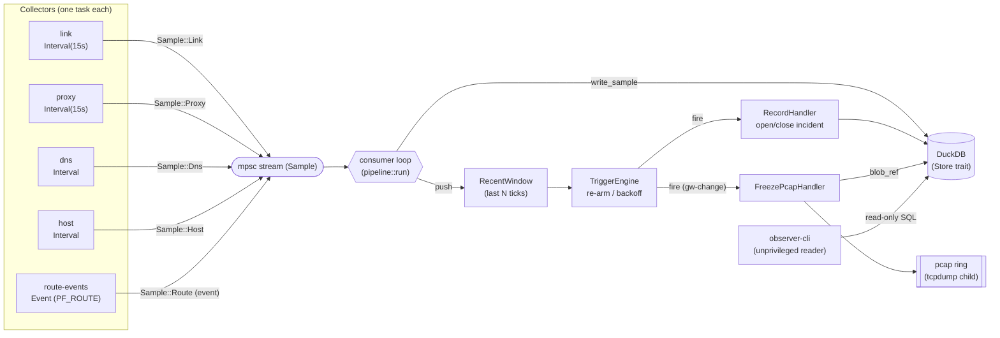
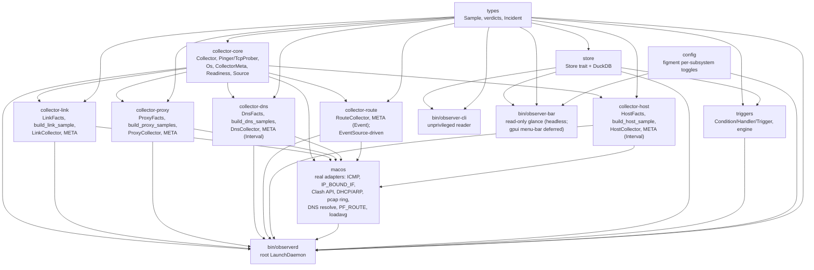

# Architecture

`observer` is a Rust network-forensics collector for macOS. It replaces a
hand-rolled ~470-line `bash` LaunchDaemon (`net-observer`) with a structured,
queryable pipeline whose north star is **incident forensics**: a rich, SQL-able
snapshot of network/system state *around outages*, so post-incident analysis is
a query ("что было в 17:26") instead of grepping a columnar text log.

**v1 scope = observe + detect, never act.** The daemon collects telemetry and
fires *passive* triggers (record an incident, freeze the pcap ring). No
`launchctl kickstart`, no watchdog, no notifications in v1 — those are later
handlers behind the same `Condition → Handler` interface. The shell
`net-observer` remains the behavioral oracle (see `AGENTS.md`).

## Pipeline

Collectors emit typed `Sample`s onto an mpsc stream. A single consumer persists
each sample into DuckDB, keeps a small in-memory recent window, and evaluates the
trigger engine on every sample so a freeze can happen *before* the slow
`arp`/`log show` work and before the pcap ring rotates over the packets around a
drop.

- **Collectors** — one task per subsystem, each on its own cadence. `link`,
  `proxy`, `dns`, and `host` are `Interval` collectors (timer →
  `collect(ts_us)` on the blocking pool). `route-events` is the first **Event**
  collector: the daemon takes its `EventSource` and drives the blocking
  `next()` loop (a PF_ROUTE socket `recv`) on the blocking pool, forwarding
  samples as the kernel announces interface/route changes.
- **Consumer** (`bin/observerd/src/pipeline.rs::run`) — drains the stream,
  writes each sample to the store (a write error is *logged as a gap*, never
  silently dropped), pushes into the `RecentWindow`, and evaluates the engine.
- **TriggerEngine** — starter rules ported from the oracle: `wedge`, `gw-drop`,
  `gw-change` (unconditional pcap freeze on any gateway change), `fakeip`,
  `starvation`. Each fires at most once per 5 min (backoff) and disarms until the
  signal returns to OK.
- **observerd** — the root LaunchDaemon: load config → build enabled collectors
  as `Box<dyn Collector>` → filter by `meta().supports(Os::current())` then
  `preflight()` → spawn survivors → run the consumer → clean SIGTERM/SIGINT
  shutdown.
- **observer-cli** — unprivileged; opens the same DuckDB file read-only for
  `status` / `incidents` / `query`.

### Collector capability model

Every collector carries two capability signals so the daemon decides, per
collector, whether to run it at all:

- **Static OS metadata** — `CollectorMeta { name, supported_os }`; v1 collectors
  declare `&[Os::MacOs]`. A collector whose meta does not `supports(Os::current())`
  is skipped.
- **Runtime preflight** — `preflight() -> Readiness` (`Ready` /
  `Unavailable(String)`), delegated to the port facts: `link` is Ready iff a
  physical interface resolves; `proxy` iff the sing-box config exists or the
  Clash API is set. A failing preflight is logged (absence of a signal is itself
  diagnostic) and the collector is not spawned.

## Crate graph

The monolithic `collectors` crate is split into `collector-core` (abstractions
only) plus one crate per collector. Adding a subsystem (`dns`, `route`, `host`)
means adding a crate that depends on `collector-core`, never touching the others.

- `collector-core` depends on `types` only — and **not** on tokio; `Source` /
  `EventSource` keep it runtime-agnostic. The async driving of both cadences
  lives in `observerd`.
- `collector-link` / `collector-proxy` / `collector-dns` / `collector-host` are
  `Interval` collectors; each depends on `types` + `collector-core` and holds its
  port trait (`LinkFacts` / `ProxyFacts` / `DnsFacts` / `HostFacts`), the pure
  `build_*` mapping logic (unit-tested with fakes), a static `META`, and the
  `Collector` impl.
- `collector-route` is the first **Event**-cadence collector: it wraps a
  `Box<dyn EventSource>` (the real PF_ROUTE source lives in `macos`) and reports
  `Source::Event`; `observerd` drives its blocking `next()` loop on the blocking
  pool.
- `macos` implements every port trait with the real adapters (raw ICMP,
  `IP_BOUND_IF` TCP probes, Clash API, DHCP/ARP facts, DNS resolve, the
  persistent PF_ROUTE `EventSource`, `getloadavg`) plus the pcap ring and the
  per-collector `preflight()` checks.
- `bin/observerd` wires everything; `bin/observer-cli` and `bin/observer-bar`
  only read `store`. `bin/observer-bar` is a **read-only glance** at the DuckDB
  file (latest link/proxy tick + recent incidents); the gpui/`NSStatusItem`
  menu-bar UI is deferred (gpui's build script needs the macOS **Metal
  Toolchain**), so it ships today as a headless printer with a `TODO(menu-bar)`.
  It is a full workspace member but is excluded from `default-members` so a bare
  `cargo build` needs no GUI toolchain; build it with `--workspace` / `-p
  observer-bar`.

## Data model (DuckDB)

Normalized per subsystem — each stream has its own timestamp and cadence;
cross-stream correlation is via DuckDB's native `ASOF JOIN`. Big blobs (pcap
freezes, `log show` dumps) live as files on disk; only a `blob_ref` metadata row
goes in the DB. Timestamps are microseconds since the epoch (`ts_us BIGINT`).

| Table | Columns | Notes |
| --- | --- | --- |
| `link_sample` | `ts_us, gw, gw_rtt_ms, direct, direct_rtt_ms, dhcp_router, dhcp_dns, gw_arp_mac, ssid, wifi_capture_present` | Local path: gateway ping, direct TCP (bound to phys iface), DHCP/ARP facts, Wi-Fi SSID + CoreCapture presence. |
| `proxy_sample` | `ts_us, server_ip, tcp, rtt_ms, tun_code, selector` | Per-VLESS TCP reachability, tun HTTP 204 (`tun_code`), Clash selector. |
| `dns_sample` | `ts_us, probe, server, verdict, ip, rtt_ms` | One row per resolver probe (name label × resolver path); `verdict` drives the `fakeip` trigger. |
| `route_event` | `ts_us, kind, iface, detail` | PF_ROUTE event stream (`kind` = `iface` / `addr` / `route`): iface up/down, addr add/loss, default-route change. |
| `host_sample` | `ts_us, load1, load5, load15` | Host load averages — the `starvation` discriminator. |
| `incident` | `id PK, opened_us, closed_us, trigger_id, signature` | Open incident ⇒ `closed_us IS NULL`. |
| `blob_ref` | `id, incident_id, ts_us, kind, path` | On-disk forensics blobs (pcap freeze, dumps) referenced by path. |
| `trigger_fired` | `ts_us, trigger_id, incident_id, detail` | One row per trigger fire. |

`dns_sample`, `route_event`, and `host_sample` are created by the v1.1 `dns`,
`route-events`, and `host-metrics` collectors respectively.

### Verdict vocabulary

Ported from the oracle and cross-checked against recorded log excerpts:

- DNS: `OK / FAKEIP / EMPTY / SERVFAIL / NXDOMAIN / TIMEOUT / SKIP`
- Gateway: `OK / FAIL / NOGW`
- TCP: `OK / FAIL / SKIP`

`FAKEIP` on a `.ru` name is always a bug. **`SKIP` means a prerequisite was
missing — it is recorded explicitly, never omitted**: absence of a signal is
itself diagnostic.

## Privilege split

`observerd` is a headless **root** LaunchDaemon (needs raw ICMP, PF_ROUTE,
`tcpdump`, reading the sing-box config). `observer-cli` and `observer-bar` are
**unprivileged** and only read the DuckDB file (`observer-bar` opens it
`access_mode=read_only` to avoid contending for DuckDB's single read-write slot
while the daemon holds it). `observer-bar` is today a read-only glance; its
eventual gpui/`NSStatusItem` menu-bar UI (deferred pending the macOS Metal
Toolchain) stays a separate unprivileged binary — never the daemon itself.
