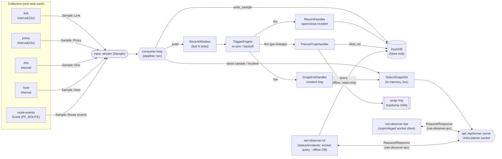

# Architecture

`net-observer` is a Rust network-forensics collector for macOS. It supersedes a
hand-rolled ~470-line `bash` LaunchDaemon of the same name with a structured,
queryable pipeline whose north star is **incident forensics**: a rich, SQL-able
snapshot of network/system state *around outages*, so post-incident analysis is
a query ("что было в 17:26") instead of grepping a columnar text log.

**v1 scope = observe + detect; act only on an explicit, gated request.** The
daemon collects telemetry and fires *passive* triggers (record an incident,
freeze the pcap ring) — it **never acts automatically**. The single write/control
path is manual and human-in-the-loop: an operator's `Request::Control` (from the
CLI `kickstart` subcommand — no longer surfaced in the bar) asks the daemon
to `launchctl kickstart -k` the sing-box service, and the daemon runs it **only
when `acting.enabled` is set** — off by default, so every acting-class control
request is otherwise refused without running anything. Distinct from acting is an
**observing on/off switch** (`ControlCmd::SetObserving`): benign *self-control*
that pauses/resumes the daemon's OWN collection (the collectors stop producing
samples; the daemon stays alive and the socket keeps serving). It touches neither
sing-box nor the network, so it is **not** gated by `acting.enabled` — though,
like every control request of either class, it must first pass the daemon's
peer-credential check, and every pause/resume edge is recorded durably so the
resulting silence is bounded rather than bare. See
[Control path](#control-path). No watchdog, no automatic recovery, no
notifications in v1 — those remain later handlers behind the same
`Condition → Handler` interface. The shell `net-observer` remains the behavioral
oracle (see `AGENTS.md`).

## Pipeline

Collectors emit typed `Sample`s onto an mpsc stream. A single consumer persists
each sample into DuckDB, keeps a small in-memory recent window, and evaluates the
trigger engine on every sample so a freeze can happen *before* the slow
`arp`/`log show` work and before the pcap ring rotates over the packets around a
drop.



- **Collectors** — one task per subsystem, each on its own cadence. Every
  collector is a **native `async fn`** (`Collector::collect` / `preflight` are
  `async fn` in the trait — no `async-trait` macro, no future-boxing). `link`,
  `proxy`, `dns`, and `host` are `Interval` collectors: the daemon `await`s
  `collect(ts_us)` directly on the tokio runtime each tick — **never** on the
  blocking pool (the probes do their own async I/O). `route-events` is the first
  **Event** collector and the one true exception: its PF_ROUTE `next()` is a
  genuinely uninterruptible blocking `read(2)`, so the daemon drives it on a
  dedicated OS thread (`std::thread::spawn`, bridged to the async stream via
  `blocking_send`), forwarding samples as the kernel announces interface/route
  changes. See [Async collectors](#async-collectors) below.
- **Consumer** (`bin/net-observerd/src/pipeline.rs::run`) — drains the stream,
  writes each sample to the store (a write error is *logged as a gap*, never
  silently dropped), mirrors the sample into the live `StatusSnapshot`, pushes
  into the `RecentWindow`, and evaluates the engine.
- **TriggerEngine** — starter rules ported from the oracle: `wedge`, `gw-drop`,
  `gw-change` (unconditional pcap freeze on any gateway change), `fakeip`,
  `starvation`. Each fires at most once per 5 min (backoff) and disarms until the
  signal returns to OK.
- **Live snapshot + local socket API** — the consumer keeps an in-memory
  `StatusSnapshot` (the latest sample per collector + `generated_us`) current on
  every tick, and a passive `SnapshotHandler` mirrors each fired incident into a
  bounded ring (newest first). `net-observerd` serves this snapshot over a
  Unix-domain socket (`bin/net-observerd/src/api.rs`, `ApiServer::serve` — a tokio
  `UnixListener`),
  answering entirely from memory — no DB read on the request path, zero contention
  with the writer. See [Local socket API](#local-socket-api) below.
- **net-observerd** — the root LaunchDaemon: load config → open the store →
  record the **startup observing edge** (`record_startup_edge`, before any
  collector can produce a sample) → build enabled collectors as an
  `AnyCollector` **enum** (static dispatch — see
  [Async collectors](#async-collectors)) → filter by
  `meta().supports(Os::current())` → spawn them → start the pcap ring → spawn
  the socket API server (after the ring, so a `FreezePcap` request is answered
  by the ring that is actually running) → run the consumer → clean
  SIGTERM/SIGINT shutdown (the API task is aborted alongside the collectors).
  `preflight()` is consulted at startup too, but for an **interval** collector
  it only logs context — it no longer decides whether the collector runs (see
  [Collector capability model](#collector-capability-model)).
- **net-observer-cli** — unprivileged; `status` / `incidents` read the daemon's live
  `StatusSnapshot` over the socket (`net_observer_ipc::query`), so they work *while the
  daemon runs* with zero DB contention. `query <SQL>` is the only DB path: it opens
  the DuckDB file read-only for ad-hoc forensics, which succeeds only when no daemon
  holds the store (the file lock otherwise blocks the open — reported as a clear
  message, never a panic).
- **net-observer-bar** — unprivileged **menu-bar** app and a *pure socket client*: it
  never opens the DB, fetching the live `StatusSnapshot` from the daemon over the
  socket via `net_observer_ipc::query`.

### Collector capability model

Every collector carries two capability signals so the daemon decides, per
collector, whether to run it at all:

- **Static OS metadata** — `CollectorMeta { name, supported_os }`; v1 collectors
  declare `&[Os::MacOs]`. A collector whose meta does not `supports(Os::current())`
  is skipped.
- **Runtime preflight — a per-tick CONDITION, not a startup gate.**
  `async fn preflight() -> Readiness` (`Ready` / `Unavailable(String)`),
  delegated to the port facts: `link` is Ready iff a physical interface
  resolves; `proxy` iff the sing-box config exists or the Clash API is set. For
  an **interval** collector the daemon spawns it regardless of the startup
  verdict, and `spawn_interval_collector` re-runs `preflight()` on **every**
  tick: `Ready` → `collect(ts_us)`; `Unavailable(reason)` → the collector's own
  `skip(ts_us)` samples for that tick, and the very next tick re-probes. A
  prerequisite missing at boot — `RunAtLoad` starts the daemon before any
  interface is up — used to disable the collector for the life of the process
  with nothing in the record saying why, which is bare silence: the exact
  failure this project exists to catch. Now the record carries `SKIP` rows until
  the prerequisite appears and real samples the moment it does, with no restart.
  The log is rate-limited around the durable record: the first unready tick and
  every **change** of reason log at `warn`, the rest at `debug`, and the
  recovery logs the number of skipped ticks — the `SKIP` samples are the record,
  the log is only its narration.
- **Two things stay one-shot, both deliberately.** The **event** cadence: the
  `route` collector's PF_ROUTE socket is opened by `PfRouteSource::open()`
  *before* construction and moved into the collector, so there is nothing left
  to re-probe per tick and no tick to re-probe on — an `Unavailable` event
  collector is logged and skipped for the life of the process ("event cadence:
  not retried"), and retrying it means a supervisor around
  `spawn_event_collector` that reopens the socket. And the **pcap ring**: it is
  a `tcpdump` child started once by `maybe_start_pcap_ring` and handed to the
  API server, so `FreezePcap` can answer about the ring that is actually
  running; a boot that resolves no physical interface leaves the daemon with no
  ring for its lifetime, logged as `"no physical interface resolved; pcap ring
  disabled (not retried)"` and marked in the source as a known gap. Both are
  named here rather than papered over: they are the two places where a missing
  prerequisite is still permanent.

### Async collectors

Collectors and their probe ports are **native `async fn`** (Rust ≥ 1.75), not the
`async-trait` macro:

- `Collector::collect(&self, ts_us) -> Vec<Sample>` and `preflight()` are
  `async fn`; the probe ports (`Pinger::ping_gw`, `TcpProber::connect_bound`, the
  per-collector `*Facts` traits) are `async fn` too. The traits carry
  `#[allow(async_fn_in_trait)]` — they are internal workspace ports, never a
  published API — so there is no boxing and no macro. `source()` / `meta()` /
  `skip()` stay sync; `EventSource::next()` stays a **sync** blocking call (it
  only ever runs on the dedicated event thread, never on the runtime).
- **`collect()` awaits the probes, then a sync `build_*` composes the `Sample`.**
  All async lives in the probes; the pure mapping (`build_link_sample`,
  `build_proxy_samples`, …) stays synchronous, so the mapping unit tests remain
  trivial (fakes are `async fn` under `#[tokio::test]`).
- **Enum dispatch, not `dyn`.** A native-`async fn` trait is not
  `dyn`-compatible, so `net-observerd` drives its heterogeneous collector set through
  an `enum AnyCollector { Link, Proxy, Dns, Route, Host }` whose inherent methods
  delegate by `match` and `.await` the concrete arm. Every arm is a concrete
  type, so the composed `collect` future is `Send` and spawns onto the runtime
  with **no `Box::pin` and no vtable**.
- **The interval path never touches the blocking pool.** `spawn_interval_collector`
  is a `tokio::time::interval` loop that `await`s `collect(ts_us)` directly;
  a probe failure is turned into `SKIP` samples inside the collector, so one
  failing collector keeps ticking and never takes down the others. The only
  blocking primitive is the PF_ROUTE `read(2)`, isolated on its own OS thread by
  `spawn_event_collector`.
- **A shared `observing` flag pauses collection — and every edge is recorded.**
  Both spawners take an `Arc<AtomicBool>` (`observing`, default `true`) that the
  operator flips via the `SetObserving` control command. Each cycle checks it with
  `Ordering::Acquire`: the interval loop `continue`s **before** `collect()` (skips
  the probe entirely, so a paused collector produces no samples), and the event
  thread keeps draining the source with `next()` (so the PF_ROUTE socket never
  backs up) but `continue`s **before** forwarding the batch. The loops keep
  running while paused, so `SetObserving(true)` resumes probing/forwarding on the
  very next tick — this is the pause/resume the menu-bar switch drives.
  The resulting silence is **bracketed, not bare**: each real transition builds a
  single `types::ObservingEdge` that goes to two sinks — a durable
  `observing_edge` row via the `Store`, and a `StreamFrame::Observing` frame on
  the realtime bus — so one value describes the transition to both the offline
  record and every live subscriber, and they cannot drift. A `SetObserving` that
  does not change the state is not an edge: no row, no frame, because a no-op
  click must not manufacture a gap. This is the sanctioned exception to
  [SKIP, never silence](#verdict-vocabulary).
- **The RESUME edge clears the pipeline's recent-sample window — and re-opens
  detection.** The control socket publishes the resume `ts_us` into a shared
  `Arc<AtomicI64>` (`resume_at_us`) that `pipeline::run` reads on each drained
  sample; when it moves, the consumer calls `RecentWindow::clear_for_resume()` and
  then `TriggerEngine::rearm_all()` before pushing anything new. `Wedge` and the
  other count-based conditions carry **no time bound**, so pre-pause samples left
  in the window would let two bad ticks from before an arbitrary observation gap
  combine with one after it into an incident asserting a continuity that never
  existed ("tun dead 3 ticks"). A resume therefore **re-opens** detection; it does
  not dedup it: every trigger is re-armed, so a fault that is still present when
  collection resumes is recorded again — as a **new** incident belonging to the new
  observation session, not as a duplicate of the pre-pause one. Re-arming is
  explicit because the alternative is accidental: an emptied window re-arms a
  trigger only *if* the next sample is one its condition reads nothing from (a
  `host` tick re-arms `gw-drop`; a `link` tick leaves it latched), which made "does
  a persistent fault re-fire across a pause?" depend on collector arrival order.
  What a resume does **not** do is reset the firing budget: `last_fire_us` survives
  it, so each trigger still fires at most once per `backoff_us` and a toggled
  switch cannot storm the incident log. The `observing_edge` rows bound the gap
  between the two records.
- **Exactly one thing survives that clear: the gateway-CHANGE BASIS.**
  `clear_for_resume` carries the newest `LinkSample` forward, reachable **only**
  through `RecentWindow::prev_link` / `prev_link_with_provenance` — never through
  `last_link`, `recent_link`, `recent_proxy`, `recent_dns` or `is_empty`. The
  oracle freezes the pcap ring on **any** gateway change, and the ring is started
  once in `main` and is **not** gated by `observing`, so `tcpdump` keeps filling it
  throughout a pause: the packets around a gateway change that happened *during*
  the pause are physically still in the ring at resume. Firing `GwChange` there
  makes `FreezePcapHandler` preserve real evidence, where dropping it would only
  issue a receipt for evidence that was lost. Change detection needs exactly one
  prior sample, never a run of them, so nothing else is carried: `GwDrop` and
  `Starvation` still cannot assert pre-pause state as the present, and `Wedge`
  still loses its entire history and still cannot span the gap — the
  false-continuity rule above is unchanged. The basis is retired by the **second**
  post-clear link *push* (counted, not inferred from the buffer: a burst of
  non-link samples can evict the first post-clear link, and an hours-old basis must
  never resurface as the neighbour of an unrelated sample), and it is *kept* across
  a resume that saw no link sample at all, since the last gateway state this daemon
  actually observed stays the truthful thing to compare against however many gaps
  sit in between. A change measured against the basis is reported as
  `LinkProvenance::AcrossGap` and its incident detail ends in
  " (across an observation gap)", so an offline reader never mistakes it for two
  consecutive ticks.
- **The post-resume in-flight filter is bounded by a MONOTONIC clock.** A sample
  produced before the resume is on the far side of the observation gap and is kept
  *out of the fresh window* — it is still persisted and still published (it is a
  real observation), but it must not reinstate the very continuity the clear just
  removed. Which sample is stale can only be decided on the **wall** clock: a
  `Sample` carries no other time, and the resume epoch is a `types::now_us()` taken
  by the control path. A wall-clock comparison *alone*, though, is a latent
  total-detection outage — one backwards step (NTP, sleep/wake, a manual `date`)
  larger than the collector cadence makes `ts_us < resume_us` hold for *every*
  future sample, and the consumer would then skip `window.push` and
  `engine.on_sample` for ever. So `pipeline::ResumeGate` bounds how long that
  comparison may be applied **at all**, with a monotonic `Instant` deadline
  (`RESUME_DRAIN`, 5 s) and a drop cap (`RESUME_DRAIN_MAX_SAMPLES` = 2 ×
  `CHANNEL_CAP`); when either bound is reached the gate closes until the next
  resume edge and every sample reaches the window again. It is evaluated lazily, at
  sample time — no timer, no task — so an armed gate on a silent stream has by
  construction held nothing back. Nothing is silent: the first drop of an episode
  and the episode total are logged at `warn`, and the process total on the
  consumer's exit line. The failure mode is "briefly over-accept", never "silently
  stop detecting". See [Control path](#control-path).

## Crate graph

The monolithic `collectors` crate is split into `collector-core` (abstractions
only) plus one crate per collector. Adding a subsystem (`dns`, `route`, `host`)
means adding a crate that depends on `collector-core`, never touching the others.


- `collector-core` depends on `types` only — and **not** on tokio: native
  `async fn` traits need no runtime crate, and `Source` / `EventSource` keep the
  crate runtime-agnostic. The async driving of both cadences lives in `net-observerd`.
- `collector-link` / `collector-proxy` / `collector-dns` / `collector-host` are
  `Interval` collectors; each depends on `types` + `collector-core` and holds its
  port trait (`LinkFacts` / `ProxyFacts` / `DnsFacts` / `HostFacts`), the pure
  `build_*` mapping logic (unit-tested with fakes), a static `META`, and the
  `Collector` impl.
- `collector-route` is the first **Event**-cadence collector: it wraps a
  `Box<dyn EventSource>` (the real PF_ROUTE source lives in `macos`) and reports
  `Source::Event`; `net-observerd` drives its blocking `next()` loop on a dedicated
  OS thread (not the async runtime — its `read(2)` cannot be interrupted).
- `macos` implements every port trait with the real adapters, all on
  **async-native I/O** on the daemon's tokio runtime: `surge-ping` (raw ICMP),
  `socket2` + `tokio::net::TcpStream` with `IP_BOUND_IF` (bound TCP probes),
  `reqwest`'s **async** client (Clash API, TUN 204 probe, DoH), and
  `tokio::process::Command` (DHCP/ARP + Wi-Fi subprocesses); `getloadavg` stays
  an inline syscall inside its `async fn`. The blocking PF_ROUTE `EventSource`
  and the pcap ring are the only non-async pieces. **`ureq` was dropped** in
  favour of `reqwest` async — the earlier `reqwest::blocking`-inside-tokio
  startup panic cannot recur. `macos` also carries the per-collector
  `preflight()` checks.
- `net-observer-ipc` is the shared local-socket protocol crate: the wire types
  (`Request`, `Response`, `StatusSnapshot`, `IncidentSummary`, and the
  subscription envelope `StreamFrame` with its `Ready` / `Gap` / `StreamError`
  payloads), the newline-delimited JSON framing (`write_frame` / `read_frame`),
  the serialise-once bus payload `EncodedFrame` (which also owns the single
  filter rule, `passes`), and the blocking `query` / `subscribe` clients. It
  depends on `types` + serde only and is deliberately **runtime-agnostic** — no
  tokio — so both the async server in `net-observerd` and the blocking clients in
  `net-observer-bar` / `net-observer-cli` share one definition of the format, and one
  rendering (`StreamFrame::label` / `detail`) of every frame.
- `bin/net-observerd` wires everything and owns the DuckDB store; `bin/net-observer-cli`
  reads `store` read-only, while `bin/net-observer-bar` reads live status over the
  socket via `net-observer-ipc` and **never touches the DB**. `bin/net-observer-bar` is a
  macOS **menu-bar app**: a dockless (`.accessory`) `NSStatusItem` (AppKit interop
  via `objc2` / `objc2-app-kit`) whose icon-only health dot shows the latest
  link/proxy health and whose click toggles an anchored **gpui** popup (a
  Tailscale-style dropdown — `WindowKind::PopUp`, anchored under the icon,
  dismissed on click-away) rendering the full `StatusSnapshot`
  (latest link/proxy tick + recent incidents), re-queried on a ~3s timer; a down
  daemon / absent socket degrades to a graceful "net-observer offline" state. The
  popup is a **Tailscale-style** panel: it reads the window's
  `WindowAppearance` and picks a LIGHT or DARK token set (never hardcoded dark),
  laid out as a clean list — a header row with the app name and an
  **observing on/off toggle switch** on the right, hairline dividers, two
  **sparklines**, label→value rows (gw / direct / tun / selector), an incidents
  line, and a footer of subtle text actions (**Events** — opens the live
  event-log window — / Refresh / **Freeze pcap** / **Quiet**|**Unquiet** / Quit;
  the "Restart sing-box" control has been removed from the bar). The panel window
  is opened `WindowBackgroundAppearance::Blurred`, which puts an
  `NSVisualEffectView` behind it, so the surface token is deliberately
  translucent (`0xRRGGBBAA`) and the base colour lighter than instinct suggests —
  an opaque fill would cover the very material that makes a popover read as part
  of the menu bar — with a faint rim (`edge`) and rounded corners, which need the
  window to be non-opaque to be visible at all.
  **The sparklines are the bar's own history, not the daemon's record.** The
  refresh timer — and *only* the refresh timer, so one column is one `REFRESH`
  interval — appends one `HistoryPoint { gw_rtt_ms, load1 }` per tick to a
  bounded `VecDeque` of `HISTORY_LEN` = 120 points: at the bar's 3 s cadence, a
  6-minute window, which is chosen against the failure the panel exists to catch
  (the coworking gateway does not drop, it *ramps* for ~40 s) and is short enough
  that 120 one-pixel columns fit the 320pt panel without downsampling, so every
  point drawn is a point measured. Both fields are `Option`, and a tick that
  measured nothing — no sample yet, a paused daemon, quiet mode (`gw = SKIP`), a
  failed or absent gateway, an unreachable daemon — renders as an **empty
  column**, never a zero-height bar on the baseline: plotting a missing
  measurement as a value on the floor is the same lie `SKIP` exists to prevent.
  The plot is a row of thin `div`s (gpui 0.2.2 has no chart primitive) with a
  hairline at the threshold — `RTT_THRESHOLD_MS` = 300 ms, and `LOAD_THRESHOLD` =
  10.0, the same number the daemon's `Starvation` condition uses, so the line the
  operator watches and the line the trigger fires on are one line. The series
  starts empty at bar launch and dies with the process: a short line after a
  restart means "the bar just started", never "the network was fine". The
  daemon's DuckDB store is the record, and the bar never opens it. The toggle is a
  gpui-drawn pill (green track + knob-right when `snapshot.observing`, grey +
  knob-left when paused); clicking it sends `Control(SetObserving(!observing))`
  over the socket (`send_set_observing`) and refreshes, and the header
  shows a muted "paused" state (grey dot) while collection is off. gpui's
  build script needs Apple's **Metal shader compiler**, so the crate is a full
  workspace member but is excluded from `default-members` — a bare `cargo build`
  needs no GUI toolchain. Build the bar with `--all` / `-p net-observer-bar`
  **from inside `nix develop`**, whose `xcrun` shim is what finds `metal`; the
  bar is for that reason the one binary the flake cannot package (see
  [Packaging (nix)](#packaging-nix)).

## Data model (DuckDB)

Normalized per subsystem — each stream has its own timestamp and cadence;
cross-stream correlation is via DuckDB's native `ASOF JOIN`. Big blobs (pcap
freezes, `log show` dumps) live as files on disk; only a `blob_ref` metadata row
goes in the DB. Timestamps are microseconds since the epoch (`ts_us BIGINT`).

| Table | Columns | Notes |
| --- | --- | --- |
| `link_sample` | `ts_us, gw, gw_rtt_ms, direct, direct_rtt_ms, dhcp_router, dhcp_dns, gw_arp_mac, ssid, wifi_capture_present` | Local path: gateway ping, direct TCP (bound to phys iface), DHCP/ARP facts, Wi-Fi SSID + CoreCapture presence. |
| `proxy_sample` | `ts_us, server_ip, tcp, rtt_ms, tun_code, selector` | Per-VLESS TCP reachability, tun HTTP 204 (`tun_code`), Clash selector. |
| `dns_sample` | `ts_us, probe, server, verdict, ip, rtt_ms` | One row per resolver probe (name label × resolver path); `verdict` drives the `fakeip` trigger. |
| `route_event` | `ts_us, kind, iface, detail` | PF_ROUTE event stream (`kind` = `iface` / `addr` / `route`): iface up/down, addr add/loss, default-route change. |
| `host_sample` | `ts_us, load1, load5, load15` | Host load averages — the `starvation` discriminator. |
| `incident` | `id PK, opened_us, closed_us, trigger_id, signature` | Open incident ⇒ `closed_us IS NULL`. |
| `blob_ref` | `id, incident_id, ts_us, kind, path` | On-disk forensics blobs (pcap freeze, dumps) referenced by path. |
| `trigger_fired` | `ts_us, trigger_id, incident_id, detail` | One row per trigger fire. |
| `observing_edge` | `ts_us, observing, peer_uid, cause` | One row per collection boundary — the one sanctioned gap in "SKIP, never silence"; `observing` is the state entered, so `false` opens a gap and `true` closes one. `peer_uid` attributes it to the control-socket peer that asked (SQL `NULL` when nobody did), and `cause` (`control` / `startup`) says what produced it. |

`dns_sample`, `route_event`, and `host_sample` are created by the v1.1 `dns`,
`route-events`, and `host-metrics` collectors respectively.

`observing_edge` is empty for any database written before the pause switch
landed — an empty table means "nothing was ever recorded", not "never paused".
Every *running* daemon writes at least one row, because a start is itself a
boundary: `ObservingCause::Startup`, `observing = true`, `peer_uid` NULL (nobody
asked — the process booted). The observing **state** is still never persisted;
only the **transition** is, and that distinction is the whole point. A daemon
killed while paused writes no resume edge, so before the startup edge existed a
dangling `false` row had to be read as "the process died while paused" and the
end of the silence had to be *inferred* from the first sample of the next run.
It is now a recorded fact: the next start's `startup` row says where collection
resumed. The `cause` column was added after the first daemon shipped rows
without it, so `schema.rs` runs
`ALTER TABLE observing_edge ADD COLUMN IF NOT EXISTS cause VARCHAR` on open (the
CLI's offline `query` opens whatever file it is handed); rows written by that
daemon read back with a `NULL` cause, which the gap derivation treats as
`control` — which is what they in fact were.

### Diagnosis queries

`crates/store/src/diagnosis.rs` is the read side: the canned SQL that turns the
record into *which layer failed*, so the reading of an outage is reproducible
instead of re-derived by hand. Each is a `*_sql()` builder plus a `DuckdbStore`
method that runs it with the defaults (`DEFAULT_STARVATION_LOAD` = 10.0, matching
the daemon's `STARVATION_LOAD`; `DEFAULT_EPISODE_GAP_US` = 30 s;
`DEFAULT_RAMP_WINDOW_US` = 120 s). Correlation across cadences is by `ASOF JOIN`
— the join the whole storage choice was made for.

| Query | Answers |
| --- | --- |
| `verdict_at(ts_us)` | every layer's state at a moment, plus the `layer` the record blames |
| `incident_context()` | for each incident, the layer state at or just before it opened |
| `wedge_vs_starvation()` | contiguous `tun=000` episodes, each named `link` / `vless` / `starvation` / `wedge` / `unknown` |
| `gw_drops()` | the first link sample of each run of `FAIL`/`NOGW` (`SKIP` ticks removed first, so a quiet run cannot manufacture an edge) |
| `gateway_ramp(drop_ts_us)` | gateway RTT over the window before a drop, with a least-squares `slope_ms_per_s` over the answered ticks — the ~40 s coworking climb as data |
| `fakeip_bugs()` | `FAKEIP` on a `.ru` name, which is always a bug |
| `observation_gaps()` | one row per interval the daemon deliberately collected nothing |

The `layer` vocabulary is `link` / `vless` / `proxy` / `host` / `healthy` /
`unknown` / `gap`. **The refusals are the point.** No query counts a `SKIP` as
health or as fault, and two situations make a query decline outright rather than
answer:

- **A dead tun with no `load1`.** `tun_code = 0` is a wedge if the host was idle
  and starvation if it was not, and without a host sample the record cannot tell
  them apart — so the layer is `unknown`, never a guess at `proxy`. The
  distinction is the one the project paid nine hours to learn on 2026-07-27: a
  restart cures a wedge and *tears down live flows* under starvation.
- **A moment inside an observation gap.** An `ASOF JOIN` would honestly hand back
  the newest sample from *before* a pause as though it were a reading taken at
  the moment asked about, with nothing in the row saying otherwise — a gap that
  is written but never read is indistinguishable from data, the same failure
  class `SKIP` exists to prevent one level up. So the queries **decline rather
  than flag**: a flag a caller must remember to check is a bare answer for
  everyone who forgets, while a withheld measurement cannot be misread.
  `verdict_at` returns a single row with `layer = 'gap'`, every measurement
  column `NULL`, and the gap's bounds in `gap_opened_us` / `gap_closed_us`;
  `incident_context` blanks the context of an incident that opened inside a gap
  the same way. `gateway_ramp` refuses where the lie would live — its *slope*: a
  least-squares fit across an interval that was never sampled is a line drawn
  through absent data and reads exactly like a measured climb, so
  `slope_ms_per_s` and `fitted_samples` come back `NULL` whenever the window
  overlaps a gap and `observation_gap_us` says by how many microseconds. The
  window's rows are real samples and are still listed; only the number is
  withheld. `wedge_vs_starvation` is deliberately untouched: its episodes are
  built from ticks that exist, so it never passes off a pre-pause reading as a
  measurement.

**Gaps are derived, not stored.** `observation_gap` opens a half-open interval
`[gap_opened_us, gap_closed_us)` at each `observing = false` edge and closes it at
the earliest of three candidates, with `gap_closed_by` naming which one it took:
`resume` (an operator `observing = true` edge), `startup` (a recorded startup
edge — this process began collecting), or `sample` (no edge at all: the first
sample of any stream, `SAMPLE_TS_CTE` over every table, an inference). A recorded
edge **wins a tie** with a sample at the same instant, because it is the fact and
the sample is only evidence of it. `gap_closed_us` is `NULL` only when nothing at
all follows the pause — the record ends inside it, which is the truth. The edge
sequence is not assumed to be well-formed pairs: a resume with no preceding pause
opens no gap, and databases written before the startup edge existed still close
their gaps by the `sample` inference.

### Verdict vocabulary

Ported from the oracle and cross-checked against recorded log excerpts:

- DNS: `OK / FAKEIP / EMPTY / SERVFAIL / NXDOMAIN / TIMEOUT / SKIP`
- Gateway: `OK / FAIL / NOGW`
- TCP: `OK / FAIL / SKIP`

`FAKEIP` on a `.ru` name is always a bug. **`SKIP` means a probe did not run —
it is recorded explicitly, never omitted**: absence of a signal is itself
diagnostic. Two routine producers of `SKIP`, neither an exception to the rule: a
collector whose per-tick `preflight()` is `Unavailable` (see
[Collector capability model](#collector-capability-model)), and **quiet mode**
(`ControlCmd::SetQuiet(true)`), where the link collector withholds the gateway
echo but still emits one sample per tick carrying `gw = SKIP` — quiet silences
the wire, never the record, and the triggers read that as *no measurement*, never
as a healthy gateway and never as a drop.

**The one sanctioned exception: an operator pause.** When collection is paused
(`ControlCmd::SetObserving(false)`) the collectors stop probing entirely rather
than emitting a per-tick synthetic `SKIP` — a deliberate operator decision is not
a failed prerequisite, and a paused hour of manufactured `SKIP` rows would bury
the real ones. That silence is nonetheless **bracketed, never bare**: every
pause/resume *edge* writes an `observing_edge` row (`ts_us, observing, peer_uid`)
and publishes a `StreamFrame::Observing` frame, so the gap has a start, an end
and an owner. `SELECT ts_us, observing FROM observing_edge ORDER BY ts_us` reads
offline as the list of intervals in which the daemon deliberately collected
nothing, which is what keeps an operator pause distinguishable from a wedged
collector. Silence *not* bracketed by those rows is a bug, not a pause. See
[Control path](#control-path) and the `observing` flag under
[Async collectors](#async-collectors).

## Local socket API

The daemon exposes live status over a Unix-domain socket so unprivileged clients
(the bar) read a fresh view *while the daemon runs* — the case the read-only
DuckDB open cannot serve, because the daemon holds the file lock. The DB stays
the durable record; the socket is the live, low-latency read path.

- **Wire protocol** (`crates/net-observer-ipc`) — a request/response pair framed as
  newline-delimited JSON:
  - `Request::Status` → `Response::Status(StatusSnapshot)`
  - `Request::Incidents { limit }` → `Response::Incidents(Vec<IncidentSummary>)`
  - `Request::Control(ControlCmd)` → `Response::Control(ControlResult)` — the
    write/control path (see [Control path](#control-path) below); the only
    non-read request. Four commands today, one acting-class and three
    self-control: `ControlCmd::KickstartProxy` (acting-class, gated) and
    `SetObserving(bool)` / `SetQuiet(bool)` / `FreezePcap` (self-control,
    ungated by `acting.enabled` — never by the peer check).
  - `Request::Subscribe { kinds }` → a **held-open stream** of newline-JSON
    `StreamFrame`s (not a single `Response`, and not bare `Event`s) — the
    realtime pub/sub path (see [Event bus and live
    subscriptions](#event-bus-and-live-subscriptions) below). The stream opens
    with a **mandatory** `StreamFrame::Ready` ack carrying the `kinds` the daemon
    actually accepted and its current `observing` state, so a fresh subscriber
    learns whether collection is live immediately instead of inferring it from
    silence. Four other frame kinds follow: `Event` (a live sample or incident),
    `Gap` (this subscriber fell behind the bus and lost `skipped` events),
    `Observing` (a real pause/resume transition — the state at subscribe time
    rides on `Ready` instead, so a state report can never be mistaken for an edge
    that never happened), and `Error` (a daemon-side refusal or failure, reported
    **in band** instead of as a bare close). Only `Event` frames are subject to
    the `kinds` filter (`None` = every `EventKind`, `Some(list)` = server-side);
    the stream-integrity frames are **always** delivered, because a filtered
    subscriber has more need to know about a hole or a pause, not less. That rule
    lives in exactly one place, `EncodedFrame::passes`. The daemon holds at most
    **256** concurrent subscriptions (`api::MAX_SUBSCRIBERS`); beyond the cap it
    answers with one decodable
    `StreamFrame::Error { code: TooManySubscribers, .. }` and closes, rather than
    a bare close a client would have to read as "daemon gone". Underneath that, at
    most **512** connections of *any* kind are handled concurrently
    (`api::MAX_CONNECTIONS`), enforced at **accept** time: over the cap the
    newcomer is closed immediately — nothing has been read, so there is no request
    to answer and no way to know which frame type the client would decode, and a
    clean EOF beats a mis-decodable one — while the incumbents are never shed.
    `MAX_CONNECTIONS > MAX_SUBSCRIBERS` is asserted at **compile time**, so the cap
    a well-behaved subscriber meets first is still the subscriber cap, with its
    decodable `StreamFrame::Error`.
  - a malformed request → `Response::Error(String)`

  `StatusSnapshot` is the latest sample per collector (`link` / `proxy` / `dns` /
  `host`), a `generated_us` stamp, an `observing: bool` (whether collection is
  live or paused — `serde(default)` via `observing_default()` so a fresh
  snapshot, and a frame from a pre-pause daemon, read `true`, never misreporting
  a healthy daemon as paused), a `quiet: bool` (`serde(default)` `false` —
  collecting but addressing no packet at the gateway, which is a different state
  from paused), and a bounded, newest-first ring of recent `IncidentSummary`s. `write_frame` / `read_frame` pin the exact framing
  (`serde_json` + `'\n'`); the crate is runtime-agnostic (no tokio) so the async
  server and the blocking client share one format definition.

- **Server** (`bin/net-observerd/src/api.rs`, `ApiServer::serve`) — a tokio
  `UnixListener`. Everything the server needs (paths, modes, the acting config,
  the `ControlPolicy`, the `observing` flag and `resume_at_us`, the snapshot, the
  store and the event bus) is bundled into one `ApiServer` the accept loop clones
  a single `Arc` of per connection. On start it removes any stale socket file,
  binds `cfg.socket_path`, `chmod`s it to `cfg.socket_mode` so the unprivileged
  bar can connect to the root-owned socket, and — when `cfg.socket_owner_uid` is
  set — `chown`s it to that uid (control-path hardening; see
  [Control path](#control-path)). One task per connection: read one `Request`,
  bounded in the three dimensions a world-connectable socket can be attacked in —
  **bytes** (`MAX_REQUEST_BYTES` = 64 KiB, so a client cannot grow daemon memory by
  never terminating its frame), **time** (`REQUEST_READ_TIMEOUT` = 10 s over the
  *whole* initial read, so a byte-per-second drip cannot extend it and a silent
  connection cannot camp on a connection slot, an fd and a task; it covers the
  **initial request only** — a held-open `Subscribe` stream is idle by design and
  is watched for EOF instead), and **connections** (`MAX_CONNECTIONS`, above). All
  three are load-bearing: without the timeout, silent connections fill the
  connection cap and lock legitimate clients out permanently; without the cap, an
  attacker opens fds faster than the timeout reaps them. Then either
  answer a **one-shot** request (`Status` / `Incidents` / `Control`) from the
  shared `Arc<Mutex<StatusSnapshot>>` the pipeline keeps current (or, for a
  `Control`, pass the peer-credential gate and then run the class-gated command),
  write one `Response`, and close; or, for a `Subscribe`, **hold the connection
  open** and stream `StreamFrame`s until the client disconnects (see [Event bus
  and live subscriptions](#event-bus-and-live-subscriptions)). The lock is held
  only long enough to clone what a reply needs — never across an `.await`, so a
  slow client can never stall the collector pipeline. Connection tasks are owned
  by the accept loop's `JoinSet` rather than detached, so aborting the server also
  tears down in-flight streams and releases their subscriber slots. The server is
  spawned by the daemon and `abort()`ed on shutdown alongside the collectors; a
  bind failure is logged but never takes the daemon down (no API, still
  collecting).

- **Client** (`net_observer_ipc::query`, used by `bin/net-observer-bar` and by
  `net-observer-cli`'s `status` / `incidents`) — a *blocking* round-trip: connect, write
  one request frame, read one response frame. A missing socket / connection-refused
  (daemon down) / protocol error all map to an `Err`, which the bar renders as the
  "net-observer offline" state and retries on its next ~3s tick, and which the CLI turns
  into a clear "net-observerd not running" message with a non-zero exit. Neither client
  links an async runtime for this.

```mermaid
sequenceDiagram
    participant Bar as net-observer-bar (client)
    participant Sock as observer.sock
    participant Srv as net-observerd api::serve
    participant Snap as StatusSnapshot (in-memory)
    Bar->>Sock: connect + write Request::Status\n
    Sock->>Srv: accept -> per-conn task
    Srv->>Snap: lock, clone snapshot, unlock
    Srv-->>Bar: Response::Status(..)\n ; close
    Note over Bar: on connect/read error -> "net-observer offline"
```

### Event bus and live subscriptions

The **realtime pub/sub** path: the daemon *pushes* events as they happen, and
clients *subscribe* — no polling. This backs the live event-log window in the bar
and the CLI `events` tail.

- **The bus.** `net-observerd::main` creates one process-wide
  `tokio::sync::broadcast::channel::<EncodedFrame>(EVENT_BUS_CAP)` (1024) and
  threads the `Sender` into both the pipeline consumer and the `ApiServer`. An
  `Event` is the live sibling of a `Sample`:
  `Event::{Link,Proxy,Dns,Route,Host}(sample)` plus
  `Event::Incident(IncidentSummary)`, each carrying its own `kind()` and `ts_us()`
  (defined in `crates/net-observer-ipc`); `StreamFrame` wraps it alongside the
  stream-integrity frames.
- **The bus payload is serialised once.** What travels on the channel is not a
  `StreamFrame` but an `EncodedFrame`: the frame already rendered to its exact
  newline-JSON bytes behind an `Arc<[u8]>`, plus the `Option<EventKind>` a filter
  tests. Cloning it per subscriber is a refcount bump, not a second `serde_json`
  pass, so N subscribers cost **one** encode instead of N — which is what
  `broadcast` requires of its payload and what makes a 256-subscriber cap
  affordable. The routing metadata is derived *from the frame* at encode time
  rather than passed alongside it, so a stream-integrity frame can never
  accidentally be filtered away and an event can never accidentally bypass a
  filter: `EncodedFrame::passes` is the single rule, tested in `net-observer-ipc`
  rather than in the server loop.

- **Publishers (push).** In `pipeline::run`, every drained `Sample` is published
  as the matching `StreamFrame::Event` on the bus (right after it updates the
  in-memory snapshot), encoded once via `EncodedFrame::encode`. Incidents are
  published by the trigger `SnapshotHandler`: on each fire it sends an
  `Event::Incident` in addition to mirroring it into the snapshot ring. Sample
  publishers first check `events_tx.receiver_count()` and skip building and
  sending the frame entirely while nobody is subscribed, so the bus costs nothing
  until someone watches (the check/subscribe race is benign — a receiver that
  subscribes later would not have got that frame anyway). With subscribers the
  sends *ignore the error* a `broadcast::Sender` returns when the last receiver
  has gone, so the pipeline never back-pressures on it; an encode failure is
  logged at `warn` and that one frame is not published.

- **A pause is an explicit frame, not just quiet.** A paused daemon
  (`observing == false`) produces no samples, so the event stream does go quiet —
  but the quiet is *not* the signal. The control socket publishes a
  `StreamFrame::Observing` carrying the same `types::ObservingEdge` it writes to
  the `observing_edge` table, unconditionally (the `receiver_count()` guard the
  sample path uses buys nothing for an operator-paced toggle), so a live
  subscriber sees the transition rather than inferring it from a stream that
  stopped. A subscriber that connects *while* paused learns the state from the
  `StreamFrame::Ready` ack instead.

- **Subscribers (the streaming handler).** On `Request::Subscribe { kinds }`,
  `api::stream_events` first claims one of the daemon's `max_subscribers` slots
  (a `fetch_update`, so two connections racing at the boundary cannot both get in;
  the slot is an RAII `SubscriberSlot` released on *every* exit path, including a
  task aborted at shutdown). A refused claim writes one
  `StreamFrame::Error { code: TooManySubscribers, .. }` and closes. Otherwise it
  calls `events_tx.subscribe()` for a fresh per-connection receiver and **then**
  writes the mandatory `StreamFrame::Ready` ack. **That order is the invariant:**
  the receiver exists before the client is told the subscription exists, so
  nothing published after `subscribe()` returns can vanish into the old
  publish-before-subscribe window — which is why the daemon's own tests no longer
  spin on `receiver_count()` waiting to be visible. `observing` is read *after*
  subscribing, deliberately: an edge landing in between is then delivered twice
  (ack + bus frame) rather than lost, and duplication is free because both carry
  an absolute state, not a delta. The loop then selects between the bus and a
  fixed one-byte read probe on the client's half (which exists only to notice a
  subscriber that went away while the stream is quiet — its content is never
  inspected, so nothing a client sends can grow daemon memory). On a received
  frame it writes the pre-encoded bytes verbatim when `EncodedFrame::passes` the
  connection's `kinds`; on `RecvError::Lagged(n)` it writes a `StreamFrame::Gap`
  and continues; on `RecvError::Closed`, a write error, or any completion of the
  probe it stops. **Gap frames are per-subscriber by nature and never travel on
  the bus** — only the connection that lagged builds and writes one, and it is
  delivered regardless of the `kinds` filter, because rendering a contiguous
  timeline across a real hole is, for a forensics tool, a lie.

- **Client** (`net_observer_ipc::subscribe`) — the blocking counterpart to `query`:
  connect, write one `Subscribe` frame, then **complete the handshake** by reading
  the mandatory `Ready` ack before returning a `Subscription` that
  `impl Iterator<Item = io::Result<StreamFrame>>`. `Subscription::ready()` exposes
  the accepted filter and the daemon's collection state at subscribe time. The
  `QUERY_TIMEOUT` bounds the handshake only — both timeouts are cleared before
  returning, because a live stream is idle by nature and a read timeout would
  strand a partial frame; use `Subscription::handle()` to wake a parked reader. A
  daemon-side refusal arrives as a decodable `StreamFrame::Error` and is mapped to
  an `io::Error` carrying the daemon's own message (deliberately *not*
  `ConnectionRefused`, which both clients already render as "net-observerd is not
  running"). Like `query`, it links no async runtime; a clean daemon close ends
  iteration.

- **The event-log window** (`bin/net-observer-bar/src/events.rs`) — a resizable,
  closable `WindowKind::Normal` window ("net-observer — events"), opened from the
  panel footer's **Events** action. It opens **one** persistent all-kinds
  subscription for its whole lifetime (never re-subscribes, never polls). Because
  `net_observer_ipc` is blocking, a dedicated OS thread drives the `Subscription` and
  forwards each frame down an `mpsc` channel; a gpui foreground task drains it into
  a shared `EventLog` model (a capped `VecDeque` of the last 1000 events) that the
  view observes and re-renders, autoscrolling to the tail. Every frame kind
  becomes a row — the `Ready` ack marks the (re)connection, and gaps, observing
  transitions and server errors are drawn in the attention colour — so a hole in
  the stream or a pause is *visible in the log* rather than inferred from silence.
  The type selector at the top filters the *displayed* rows client-side by
  `EventKind` — changing it never touches the socket, and rows with no
  `EventKind` (the stream-integrity frames) are never filtered out, mirroring the
  daemon's always-delivered rule. On daemon-down / stream-drop the thread shows an
  "offline — reconnecting" note and retries after a short delay; it never panics.
  The window handle is stashed on the shared `Glance` so a second **Events** click
  focuses the existing window instead of spawning a duplicate subscription.

- **CLI** (`net-observer-cli events [--kind K]`) — the pub/sub smoke test and a
  terminal tail: one `Subscribe`, print the `Ready` ack (so the tail opens by
  stating the collection state) and then each frame live until Ctrl-C; `--kind`
  filters server-side, and stream-integrity frames arrive regardless of it. Every
  ending is reported on stderr with its reason, but only a genuine failure (a
  daemon-side `StreamFrame::Error`, a decode/read failure) exits non-zero — an
  orderly daemon close or a closed output pipe is not a failure of the tail.

- **One rendering of a frame, two clients.** `StreamFrame::label()` and
  `StreamFrame::detail()` live on the wire type in `net-observer-ipc` and are pure
  over their input (no clock, no locale), so the CLI tail's
  `HH:MM:SS  label  detail` line and the bar's log row are the same words by
  construction rather than by two copies kept in sync.

```mermaid
sequenceDiagram
    participant Pipe as pipeline::run + SnapshotHandler
    participant Bus as broadcast::Sender<EncodedFrame>
    participant Srv as net-observerd stream_events
    participant Win as event-log window / cli events
    Pipe->>Bus: send(EncodedFrame) — serialised ONCE\n per sample / on incident fire
    Win->>Srv: connect + write Request::Subscribe { kinds }\n
    Srv->>Srv: claim subscriber slot (cap 256)\n else StreamFrame::Error + close
    Srv->>Bus: events_tx.subscribe() (per-conn receiver)
    Srv-->>Win: StreamFrame::Ready { kinds, observing }\n (AFTER subscribe: nothing published later is lost)
    loop until client disconnects
        Bus-->>Srv: recv() -> EncodedFrame
        Srv-->>Win: write bytes verbatim\n (Event frames filtered by kinds;\n Observing/Error always)
        Note over Srv,Win: RecvError::Lagged(n) -> StreamFrame::Gap\n (per-subscriber; never on the bus)
    end
    Note over Win: offline -> "reconnecting", retry (never polls)
```

### Control path

The one **write** path over the socket: a `Request::Control(ControlCmd)`. It
passes **two orthogonal gates**, both applied in exactly one place,
`api::control_request`: a peer-credential check that every control request of
either class must pass, and then the `acting.enabled` class gate below.

**Gate 1 — who may command the daemon at all.** Before any dispatch on the
`ControlCmd`, the connection's peer credentials are read from the `UnixStream`
(`peer_cred()`, `getpeereid(2)` on macOS — the peer at `connect(2)` time) and put
through the pure predicate `api::control_authorized`. It admits:

- **root** (uid 0) — it can already stop and reconfigure the daemon, so refusing
  it would be theatre;
- **the daemon's own euid** — a process running as the same user can already
  signal this one, and this is the clause that keeps an unprivileged
  `cargo test` (server and client in one process) working with no root and no
  console;
- **`socket_owner_uid`**, when the operator set it — their explicit statement
  about who owns the control endpoint (the daemon already `chown`s the socket to
  it);
- **the logged-in console user** — the out-of-the-box case for the menu-bar
  toggle against a root daemon. Identified by the owner of `/dev/console`, which
  macOS's `loginwindow` chowns to the console-session user (the same fact
  `stat -f %Su /dev/console` reports) — plain `std`, no SystemConfiguration
  binding. Resolved **fresh on every control request**, never cached: the daemon
  starts at boot before anyone has logged in, and logout / fast user switching
  must take effect immediately;
- **any uid in the new `control_uids` config key** — the escape hatch for a
  headless / SSH-only host where `/dev/console` is root-owned and the
  console-user rule authorises nobody.

Everything else — an unrelated local uid on the mode-`0666` socket — is refused,
as is a peer whose credentials could not be read: an authority decision **fails
closed**. `Status`, `Incidents` and `Subscribe` are deliberately **not** gated:
the permissive default `socket_mode` exists precisely for unprivileged readers,
and a read carries no authority. The console clause is evaluated **last**, and
only when no cheaper clause has already said yes (`control_authorized(.., None)`
is exactly "authorised with no console session"), so an authorised-by-config peer
costs no `stat("/dev/console")` at all.

Refusals are **rate-limited, never silent.** The socket is world-connectable by
default, so an unauthorised local process could otherwise grow a **root** daemon's
log at its own loop rate. Control refusals and accept-time connection-cap refusals
each go through their own `api::RateLimitedLog`: at most one `warn!` per minute
(`REFUSAL_LOG_INTERVAL`), and every line reports how many events it stands for, so
suppressed events are deferred rather than lost and the flood stays visible and
countable without being transcribed. Accept **errors** are throttled the same way,
since a persistent `EMFILE` under fd exhaustion spins the accept loop at full speed
— the same unbounded-log path by another route. The throttle is monotonic
(`Instant`) on purpose: a wall-clock step must be able neither to unmute the log
nor to mute it for ever.

Two structural guarantees make this unskippable rather than conventional:

- The check runs **before** any dispatch on the command, and on success produces
  a `PeerAuthorized` token whose field is private and which only
  `authorize_control` can construct. `control_response` — the function that
  actually dispatches — takes one **by value**, so "dispatch without a peer
  check" is unrepresentable rather than merely discouraged. The token also
  carries the peer's uid, which is what lands in `observing_edge.peer_uid`.
- The `acting.enabled` gate is derived from **one exhaustive**
  `ControlAuthority::of(&cmd)` match rather than a per-arm decision, so adding a
  third command fails to compile until someone classifies it — no command can
  inherit the weaker gate by omission.

**Gate 2 — what the daemon may touch.** Two classes of command, gated
differently and dispatched in exactly one place, `api::control_response`:

1. **Acting-class — gated by `acting.enabled`.** `ControlCmd::KickstartProxy`
   asks the daemon to restart the sing-box service via
   `launchctl kickstart -k <service>`. The client only *sends the request* — it
   never runs `launchctl` itself; the root daemon is the sole actor, and only when
   acting is on. This capability lives in the CLI (`net-observer-cli kickstart`); it is
   **not** surfaced in the bar (the bar has no "Restart sing-box" control).

2. **Self-control — NOT gated by `acting.enabled`.** `ControlCmd::SetObserving(b)`
   turns the observer's OWN collection on/off. Under the snapshot mutex (the only
   thing serialising concurrent control connections, and this is the sole writer
   of both) it stores `b` into the shared `observing` `AtomicBool` the collectors
   check each cycle and mirrors it into the live snapshot
   (`snapshot.observing`), so the switch always shows the real state. On a
   **resume** it first publishes the edge's `ts_us` into `resume_at_us`, before
   the flag, so a collector that sees `observing == true` has already
   synchronised with it and no post-resume sample can reach the consumer while it
   still reads the old epoch (see the window clear under
   [Async collectors](#async-collectors)). It touches neither sing-box nor the
   network — a purely benign, reversible pause of the daemon's own probing — so
   the *acting* gate deliberately does not apply: a client can pause/resume
   collection even with `acting.enabled == false`. It is exempt from the acting
   gate, **not** from authorisation: like every control request it must first
   pass gate 1. The daemon stays alive and the socket keeps serving throughout,
   so the same switch can turn collection back on. Clients: the bar's toggle
   switch and the CLI `observe on|off` subcommand.

   A **real transition** then goes to two sinks, from one `types::ObservingEdge`
   built once and stamped with one `ts_us`, so the offline record and the wire
   frame cannot describe the same transition differently: a durable
   `observing_edge` row via the `Store`, and a `StreamFrame::Observing` on the
   event bus. A store failure is logged as a gap and reported in the result
   message but never fails the control — the pause really did take effect, and
   `ok: false` would be a false statement about the daemon's state. A
   `SetObserving` that does **not** change the state is not an edge: no row, no
   frame, because a no-op click must not manufacture a gap in the record.

3. **Self-control — `ControlCmd::SetQuiet(b)`.** While quiet the daemon
   addresses **no packet at the gateway** — in this daemon that is the link
   collector's ICMP echo, and only that. Passive facts (ARP table, DHCP lease)
   keep being read and the link collector keeps emitting one sample per tick with
   `gw = SKIP`, so quiet silences the wire, never the record — which is why it
   writes **no** `observing_edge` row: there is no gap to bracket. Like
   `observing` it is a shared `AtomicBool` mirrored into `snapshot.quiet`, is
   process-scoped, and is never persisted. Client: the bar footer's
   **Quiet**/**Unquiet** action.

4. **Self-control — `ControlCmd::FreezePcap`.** Copy the pcap ring out now, into
   a fresh freeze directory — the same passive artifact the `gw-change` trigger
   produces, but operator-initiated. It touches only files the daemon already
   owns and sends nothing on the network. With no ring running it is a refusal
   with a reason (`ok: false`), never a silent success that would leave the
   operator believing an artifact exists. Client: the bar footer's **Freeze
   pcap** action.

`ControlAuthority::of` is the one exhaustive match that classifies all four, so a
fifth command fails to compile until someone classifies it.

```
Request::Control(cmd)  ──►  control_request(cmd, peer_uid, &cx)
                              │
                              ├─ GATE 1: control_authorized(policy, peer_uid, console_uid())
                              │     ├─ refused / peer unknown
                              │     │     └─► ControlResult { ok: false, "control refused: …" }
                              │     │         (fails closed; nothing is dispatched)
                              │     └─ allowed ─► PeerAuthorized(uid)  ── required BY VALUE by ──┐
                              │                                                                  │
                              └─ control_response(cmd, authorized, &cx)  ◄──────────────────────┘
                                    │
                                    ├─ GATE 2: ControlAuthority::of(&cmd) == Acting && !acting.enabled
                                    │     └─► ControlResult { ok: false, "acting disabled" }
                                    │         (returns before touching the actuator —
                                    │          nothing is executed)
                                    │
                                    ├─ SetObserving(b)  — SelfControl, ungated by acting
                                    │     └─► [resume: resume_at_us.store(ts)] + observing.store(b)
                                    │         + snapshot.observing = b
                                    │         └─► on a real EDGE only:
                                    │             store.write_observing_edge(&edge)   (durable)
                                    │             events_tx.send(StreamFrame::Observing(edge))
                                    │         └─► ControlResult { ok: true, "observing on|off" }
                                    │             (never touches sing-box or the network)
                                    │
                                    ├─ SetQuiet(b)      — SelfControl, ungated by acting
                                    │     └─► quiet.store(b) + snapshot.quiet = b
                                    │         (NO observing_edge row: the record keeps
                                    │          receiving one SKIP-gw sample per tick)
                                    │
                                    ├─ FreezePcap       — SelfControl, ungated by acting
                                    │     └─► freeze_now(cx) → freezer.freeze(dir)
                                    │         — or ok: false with a
                                    │         reason when no ring is running
                                    │
                                    └─ KickstartProxy   — Acting-class, gated above
                                          └─► acting::kickstart_proxy(&singbox_service)
                                              (the ONLY place launchctl runs)
                                              └─► ControlResult { ok, message }
```

**Safety invariant:** `acting.enabled` defaults to `false` (`config::ActingCfg`),
and no code path reaches the actuator (`bin/net-observerd/src/acting.rs`) unless a
`KickstartProxy` request arrives from an **authorised peer** *and* acting is
enabled. Acting is never triggered by the pipeline or a passive handler — only by
an explicit operator request. `SetObserving` is exempt from the *acting* gate by
design (self-control, no external effect) but never from authorisation: it is a
`Control` request over the same socket, so gate 1 and the socket hardening below
apply to it unchanged.

**Pause semantics: process-scoped, never persisted.** The `observing` state lives
only in the running process — it is deliberately **not** written to the store or
to any state file, and a restart always comes back collecting. Persisting it has
the dangerous failure mode: a root forensics collector that silently stays blind
across a restart nobody noticed. Restart-resumes fails safe by comparison, at the
cost of an operator having to re-pause after a daemon restart. The daemon logs the
effective observing state at startup, so the choice is explicit at every boot
rather than accidental — and the `observing_edge` table still bounds the pause
that was in effect when the process died (see the note under
[Data model](#data-model-duckdb)).

**Socket ownership / hardening.** The socket's mode and owner are *defence in
depth*, not the authorisation mechanism — the peer-credential gate above is, and
it applies whatever the file permissions are. Still, an operator enabling
`acting` should narrow who can even connect: set `socket_mode = 0o600` and
`socket_owner_uid = <logged-in uid>` so only that owner reaches the endpoint at
all. With the default `socket_mode = 0o666` the socket is world-connectable (fine
for read-only status; a stranger's `Control` is refused by gate 1, but tightening
the mode removes the attempt as well as the effect), and `socket_owner_uid` is
`None` (the socket keeps the daemon's root ownership — and then authorises no one
through that clause). On a host with no console session, `control_uids` is the
way to authorise an administrator, since the console-user rule admits nobody
there.

## Packaging (nix)

The flake ships the daemon and the CLI, and owns the launchd job that runs them.

- **`packages`** (per system, via `flake-utils.lib.eachDefaultSystem`) — one
  `rustPlatform.buildRustPackage` named `net-observer`, exposed also as
  `net-observerd`, `net-observer-cli` and `default`. The platform is built with
  `makeRustPlatform` over the channel `rust-toolchain.toml` pins, because
  `buildRustPackage` would otherwise take nixpkgs' rustc and "works in the dev
  shell" would stop meaning anything. `cargoBuildFlags` names the two binaries
  explicitly; `auditable = false` (the default `cargo-auditable` wrapper is built
  against *nixpkgs'* rustc and drags a second toolchain — sometimes a rustc built
  from source — into the build); `DUCKDB_LIB_DIR` is deliberately unset, so the
  `duckdb` crate builds its own engine (nixpkgs carries 1.5.2 where
  `libduckdb-sys` wants 1.5.5); `doCheck = false`, because testing is the dev
  shell's job — `cargo test --all` covers the bar, which this derivation cannot
  build at all.
- **`darwinModules.default`** — a nix-darwin module (`nix/darwin-module.nix`),
  deliberately **top-level, not** inside `eachDefaultSystem`: a darwin module
  takes no `system`, and nesting it would bury it under `aarch64-darwin` and force
  every importer to name the system. `services.net-observer.enable` defines
  `launchd.daemons.net-observerd` with `RunAtLoad`, `KeepAlive` and
  `ThrottleInterval = 5`, launched through
  `/bin/wait4path /nix/store && exec …` — at boot launchd can exec a store path
  before the nix volume is mounted, and a daemon that dies there dies exactly
  when the machine most needs to be observed. `package` defaults through `self`
  (the version the consumer's `flake.lock` pins, not an overlay's), `configFile`
  becomes `--config`, and `logFile` defaults to `/var/log/net-observerd.log` —
  named after the binary, **not** `net-observer.log`, because the shell
  LaunchDaemon this project replaces owns that file and two launchd jobs sharing a
  `StandardOutPath` would interleave into, and corrupt, the behavioural oracle.
  The activation script creates `/var/lib/observer` (root-owned, `755`).
- **The menu bar is not packageable.** gpui compiles its Metal shaders by calling
  `xcrun -sdk macosx metal`, and Apple does not permit redistributing that
  compiler, so it cannot enter a nix closure. The `xcrun` nix puts on PATH is
  xcbuild's reimplementation and has no `metal`. The dev shell therefore shims
  **only** `xcrun` (`metalXcrun`, first on PATH) to export `DEVELOPER_DIR` when
  Xcode is present and exec `/usr/bin/xcrun` — exporting `DEVELOPER_DIR` for the
  whole shell would find `metal` but repoint `cc`/`ld` at Xcode's SDK, and
  linking against the nix toolchain would then fail. It falls through untouched
  when Xcode is absent, so the shell still works on a machine that simply cannot
  build the GUI. Build the bar from inside `nix develop`.

## Privilege split

`net-observerd` is a headless **root** LaunchDaemon (needs raw ICMP, PF_ROUTE,
`tcpdump`, reading the sing-box config) and is the **sole owner** of the DuckDB
store. DuckDB 1.x takes a per-process file lock, so a second opener — even
read-only — is blocked while the daemon runs.

- `net-observer-cli` is **unprivileged**. Its `status` / `incidents` commands read the
  daemon's live snapshot over the socket (`net_observer_ipc::query`), so they work while
  the daemon runs. Only `query <SQL>` opens the DuckDB file `read_only`, and that
  open succeeds only when no `net-observerd` holds the store (offline forensics); while
  the daemon runs it holds the lock and the open fails with a clear message.
- `net-observer-bar` is **unprivileged** and does **not** open the DB at all: it is a
  pure client of the daemon's local socket (see [Local socket API](#local-socket-api)),
  so it reads *live* status while the daemon runs — the concurrent-live-access
  case the read-only open could never cover. A down daemon degrades to a graceful
  "net-observer offline" dot, retried each tick.

The menu-bar UI stays a separate unprivileged binary — never the daemon itself.
The daemon relaxes the socket file's mode (config `socket_mode`, default `0666`)
so the logged-in user's UI can connect to the root-owned socket. The socket is
owned by root by default; when `socket_owner_uid` is set the daemon `chown`s it to
that uid instead. What keeps the world-connectable read socket from also
accepting privileged commands is the **peer-credential gate** on every
`Request::Control` — root, the daemon's own uid, `socket_owner_uid`, the
logged-in console user, or a uid in `control_uids` — not the file mode; a
restrictive `socket_mode = 0o600` paired with `socket_owner_uid` is defence in
depth on top of it, worth setting whenever `acting.enabled` is turned on (see
[Control path](#control-path)).
